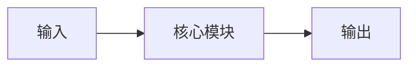

## 论文信息

| 字段 | 内容 |
|------|------|
| **标题** | 英文原标题 |
| **作者** | 作者列表 |
| **机构** | 机构列表 |
| **arXiv** | [2606.XXXXX](https://arxiv.org/abs/2606.XXXXX) |
| **PDF** | [https://arxiv.org/pdf/2606.XXXXX](https://arxiv.org/pdf/2606.XXXXX) |
| **代码** | [链接](https://github.com/...)（如有） |

**一句话总结**：核心贡献 + 关键结果 + 相比基线的提升。

---

## 研究背景

### 问题定义

当前领域面临的核心问题是什么？为什么重要？

### 现有方法局限

| 方法 | 策略 | 问题 |
|------|------|------|
| 方法 A | 描述 | 缺陷 |
| 方法 B | 描述 | 缺陷 |

**核心洞察**：> 引用论文中的关键洞察

---

## 核心方法

### 方法概述

### 关键技术细节

#### 技术 1

公式、算法、架构图：

$$公式$$

#### 技术 2

详细描述...

---

## 实验结果

### 主要结果

| 模型 | 数据集 1 | 数据集 2 | 提升 |
|------|----------|----------|------|
| 基线 | X% | Y% | - |
| 本文 | X'% | Y'% | +Δ% |

**关键发现**：
1. 发现 1
2. 发现 2

### 消融实验

| 变体 | 结果 | 说明 |
|------|------|------|
| 完整 | X% | 完整方法 |
| -组件 A | Y% | 移除 A 的影响 |
| -组件 B | Z% | 移除 B 的影响 |

---

## 个人评价

### 优点

- 优点 1
- 优点 2

### 不足

- 不足 1
- 不足 2

### 启发

- 对后续研究的启发
- 可借鉴的思路

---

## 相关论文

- [相关论文 1](https://arxiv.org/abs/...)：简要说明
- [相关论文 2](https://arxiv.org/abs/...)：简要说明